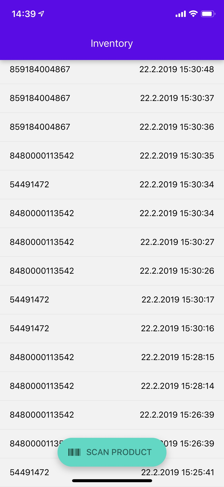
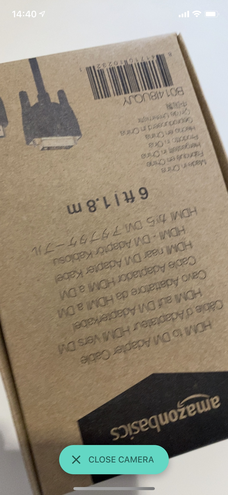

# Coding Challenge

Inventory is a small utility app that could be used in a logistics company. It has two use cases:

1. Adding products to the inventory using a bar code scanner 
2. Viewing the inventory of products  

Screenshots: 

This repository contains two implementations of the app: 

* React Native: Expo, TypeScript, React Native Paper and Redux. 
* Ionic: Capacitor, Redux, Phonegap Plugin Barcode Scanner.

The backend is a REST API provided by Airtable.

## Tasks

Project management has created tasks related to the app and put them on the Kanban board. Pick an implementation and try to solve one of the tasks within a reasonable amount of time (~2h).

---

### INV-1

**Type:** Feature

**Subject:** Product list redesign 

**Description:** The representation of the home screen's product list has been updated by our designers (link to inspectable design prototype below). Create a `ProductItem` component that implements the new design. 

- Show name (truncated to 1 line)
- Show date
- If date is within last 7 days, show a "New" icon 
- Show image
- If image is missing, show a placeholder
- Show categories as individual "Tags" 

**Tipp:** 
All product data is provided by the inventory state. Use the design prototype to inspect design requirements as well as to export image assets.

**Links:** 
https://www.figma.com/file/K8J4g5y1QnYZonwgFisvXK/Coding-Challenge?node-id=0%3A1

---

### INV-2

**Type:** Bug

**Subject:** Inventory list limited to 100 items

**Description:** On the app's home screen the user cannot scroll beyond 100 items. The list of products stops after 100 items, despite more items being stored in the backend. The app should load remaining items when the user scrolls to the end of the list.

**Tipp:** 
Airtable's REST API allows for 100 items to be fetched in one request. If there are more items, the response will contain an offset. To fetch the next page of items, include offset in the next request's parameters. Create a `fetchMoreInventory` thunk action that enables pagination using the `offset` parameter.

---

## Additional info

- The goal is not to have a perfect solution but to be able to perfectly explain whatever result you have got.
- For questions regarding the instructions don't hesitate to get back in contact with us.
